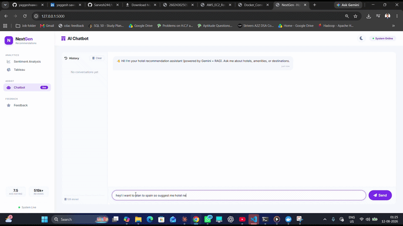

# 🏨 Next-Gen Hotel Recommendation System

> **A full-stack, AI-powered hotel recommendation platform combining RAG chatbots, sentiment analysis, and automated feedback pipelines — powered by LangGraph, Gemini, DistilBERT, and ChromaDB.**

---

## 📌 Project Overview

Designed an end-to-end Hotel Review Analytics platform processing 500K+ reviews for predictive analytics,
sentiment analysis, and business intelligence. Benchmarked 9+ classical algorithms (Logistic Regression, Random
Forest, XGBoost, SVM) with hyperparameter tuning and cross-validation to predict guest experience, deploying the
best model for real-time inference. Fine-tuned DistilBERT via LoRA for sentiment and aspect-based classification,
reducing trainable parameters and training time while preserving accuracy. Architected an RAG chatbot using
LangChain for natural-language querying, summarisation, and automated report generation. Developed a feedback
form with LangGraph agentic AI where users input feedback text, sentiment is auto-detected by the model, and
results are redirected to hotel and customer. Built an interactive UI with HTML, CSS, JavaScript, and Flask
backend integrating prediction, Tableau dashboards, the AI chatbot, and feedback form for seamless analytics.

---

## 🎥 Live Demo

### 🖼️ Application Preview


👉 [Watch Full Video](https://drive.google.com/uc?export=download&id=YOUR_FILE_ID)

---

## 🚀 Key Features

* **🔍 Sentiment Analysis:** Classifies hotel reviews as good/bad with confidence scores and a probability distribution, powered by a fine-tuned **DistilBERT** model.
* **💬 RAG-Based Recommendation Chatbot:** Retrieves relevant reviews from a **ChromaDB** vector database and generates tailored hotel recommendations using **Gemini**.
* **📊 Automated Feedback Pipeline:** Collects user feedback, auto-analyzes sentiment, sends thank-you emails to customers and alert emails to hotels (for negative feedback), and appends all responses to a **Google Sheet**.
* **🌗 Dark/Light Mode UI:** Fully responsive interface with user theme preference saved to local storage.
* **📈 Tableau Integration:** Embeds live Tableau dashboards directly into the app for analytics consumption.
* **🐳 Docker-Ready Deployment:** Runs anywhere with a single command, with a recommended path to production on **AWS EC2**.

---

## 🛠️ Tech Stack & Architecture

| Layer | Technology | Usage / Function |
| :--- | :--- | :--- |
| **Backend Framework** |  | Core web server and API layer |
| **Orchestration** |   | Workflow orchestration for RAG and feedback pipelines |
| **LLM** |  | Generates chatbot responses from retrieved context |
| **Vector Database** |  | Semantic retrieval of hotel reviews |
| **Embeddings** |  | `all-MiniLM-L6-v2` embedding model for review vectors |
| **Sentiment Model** |   | Fine-tuned classifier for review sentiment (good/bad) |
| **Notifications** |  | Automated thank-you and alert emails |
| **Feedback Logging** |  | Appends structured feedback data |
| **Frontend** |    | Single-page responsive UI with dark/light mode |
| **Visualization** |  | Embedded analytics dashboards |
| **Containerization** |  | Local environment setup and reproducible deployment |
| **Cloud Deployment** |  | Production-grade hosting on Ubuntu EC2 instance |

---

## 📁 Project Structure

```
.
├── Frontend + Backend/
│   ├── hotel.py          # Flask application (main server)
│   ├── sentiment.py      # DistilBERT model loader
│   ├── Feedback.py       # (optional) separate feedback module – integrated into hotel.py
│   └── index.html        # single-page UI
├── ML_and_DL/
│   ├── DL.ipynb          # DistilBERT fine-tuning notebook
│   └── ML.ipynb          # classical ML experiments
├── DB_pipeline/          # data processing scripts
├── run.py                # entry point
├── requirements.txt      # Python dependencies
├── Dockerfile             # build your own Docker image (optional)
├── docker-compose.yml     # run with Docker Compose
├── .env                   # environment variables (never commit)
├── updated_processed_hotel_reviews.csv  # dataset for RAG
├── chatbot_model_bundle.pkl              # fine-tuned DistilBERT model bundle
├── chromadb/              # Chroma index folder (auto-created)
└── credentials.json       # Google Sheets service account key (optional)
```

---

## ⚙️ Application Workflow

```text
[ User Query ] ──► [ Flask App ] ──► [ LangGraph Pipeline ]
                                            │
                          ┌─────────────────┼─────────────────┐
                          ▼                                   ▼
                  [ ChromaDB Retrieval ]              [ DistilBERT Sentiment ]
                          │                                   │
                          ▼                                   ▼
                  [ Gemini Response ]                [ Feedback Analysis ]
                          │                                   │
                          ▼                                   ▼
                  [ Chat UI Response ]        [ Gmail Alerts + Google Sheets Log ]
                                            │
                                            ▼
                                  [ Tableau Dashboard Tab ]
```

---

## ✅ Prerequisites

Before setting up the project locally, ensure the following are installed and configured on your system:

* **Python 3.10+**
* **Git** — to clone the repository
* **Docker** (optional, for containerized setup)
* **API & Service Credentials:**
  * Google Gemini API key
  * Gmail SMTP credentials (App Password, not your regular password)
  * Google Sheets service account key (`credentials.json`) — optional, for feedback logging
* **Required Files:** dataset (`updated_processed_hotel_reviews.csv`) and fine-tuned model bundle (`chatbot_model_bundle.pkl`) placed in the project root
* **Ports Available:** `5000` (Flask app)

---

## 🐳 Setup & Installation

### Docker Setup

**1. Clone the repository**
```bash
git clone https://github.com/your-username/Next-Gen-Hotel-Recommendation-System.git
cd Next-Gen-Hotel-Recommendation-System
```

**2. Activate a virtual environment Using the pre-built docker image (easiest):**
```bash
docker pull yaggeshsawant/my-ml-env:latest
```
*(For Linux/macOS, replace `%cd%` with `$(pwd)`)*

**3. Prepare files**
Place `updated_processed_hotel_reviews.csv` and `chatbot_model_bundle.pkl` in the root folder, and Create a `.env` file in the project root:

```env
GEMINI_API_KEY=your_google_gemini_api_key
EMAIL_HOST=smtp.gmail.com
EMAIL_PORT=587
EMAIL_USER=your_email@gmail.com
EMAIL_PASSWORD=your_app_password   # 16-character app password
EMAIL_FROM=your_email@gmail.com
HOTEL_EMAIL=hotel@yourcompany.com  # where to send alerts
```
**4. Run the app**
for windows
```bash
docker run -it --rm -p 5000:5000 -v "%cd%":/app --env-file .env yaggeshsawant/my-ml-env:latest
```
for mac/Linux terminal
```bash
docker run -it --rm -p 5000:5000 -v "$(pwd)":/app --env-file .env yaggeshsawant/my-ml-env:latest
```
> ⚠️ **Note:** The entry file must be named `run.py` (lowercase) on Linux — the Docker entry point uses `python run.py`. Case matters!

**5. Access the application**
```bash
Open `http://localhost:5000`
```

---


## 📊 Google Sheets Integration (Optional)

To log feedback to a Google Sheet:
1. Create a service account on Google Cloud Console and enable the Google Sheets API.
2. Download the JSON key and save it as `credentials.json` in the project root.
3. Share your target Google Sheet with the service account email (Editor permissions).
4. Set `SHEET_NAME` in the code (default: `"Feedback"`).

---

## 🎯 Usage

* **Sentiment Analysis Tab:** Paste a hotel review and click *Analyze Sentiment*. Returns a label (good/bad/neutral), confidence percentage, and a probability distribution bar chart.
* **Chatbot Tab:** Ask a query (e.g., "Best hotels in Spain near the beach"). The bot retrieves relevant reviews and generates a comprehensive answer using Gemini. Chat history is stored in the sidebar.
* **Feedback Tab:** Submit name, email, and feedback text — sentiment is auto-analyzed, emails are dispatched, and data is appended to your Google Sheet.
* **Tableau Tab:** View your embedded Tableau dashboard by replacing the iframe `src` URL in `index.html`.

---

